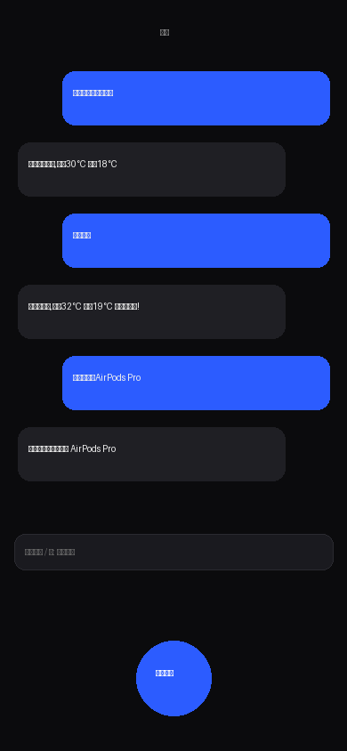

<div align="center">

# 🤖 personal-assistant

**A voice-driven AI agent that actually controls your iPhone.**

Hold the mic, say *"打开淘宝搜 AirPods"* — your phone does it.<br/>
Ask *"北京明天天气怎么样"* — it answers. Then *"那后天呢"* — context preserved.

[](https://www.python.org/)
[](https://fastapi.tiangolo.com/)
[](https://github.com/appium/WebDriverAgent)
[](https://azure.microsoft.com/products/ai-services/openai-service)
[](LICENSE)
[](tests/)
[](https://github.com/Elizabeth819/personal-assistant/actions/workflows/ci.yml)



</div>

---

## What it does

A complete voice → intent → device-action loop running on **your own infra**:

```
🎙  iPhone PWA (hold-to-talk)
      ↓ HTTPS
🧠  FastAPI server (LAN, mDNS pa-agent.local)
      ├─ Whisper      (ASR)
      ├─ GPT-4.1       (chat with multi-turn memory + screen vision)
      ├─ Realtime TTS  (Azure WS, alloy voice)
      └─ Intent planner → action chain
                ↓
📱  Tethered iPhone
      ├─ devicectl  (open any installed app by name)
      ├─ WebDriverAgent  (tap / type / swipe / screenshot)
      ├─ URL schemes (tel:, taobao:, openjd:, iosamap:, …)
      └─ Open-Meteo  (weather lookups)
```

## ✨ Features

| | Feature | Try saying |
|---|---|---|
| 📱 | **Open any app** | "打开微信 / 京东 / 小红书" |
| 🔍 | **Search inside apps** (15+ deeplinks) | "淘宝搜 AirPods Pro" / "B站搜原神" |
| 📞 | **Phone calls** | "打电话给 13812345678" |
| 🌦 | **Weather (real data)** | "上海周末会下雨吗" |
| 👁 | **Screen vision** | "看看我屏幕上写的什么" |
| 🗺 | **Navigation** | "导航去最近的星巴克" |
| 🎵 | **Music** | "播放周杰伦" |
| ⏱ | **Timer / reminder** | "5分钟后提醒我" |
| 🔗 | **Multi-step chains** | "打开淘宝**然后**搜 iPhone 壳" |
| 💬 | **Multi-turn context** | "明天天气" → "**那后天呢?**" |
| 📲 | **Mobile PWA** | Add-to-Home-Screen, hold-to-talk, dark UI |
| 🌐 | **Zero config networking** | mDNS + auto LAN-IP detection |

## 🚀 Quickstart

```bash
# 1. install
./scripts/bootstrap.sh

# 2. configure Azure OpenAI keys
cp .env.example .env && $EDITOR .env

# 3. start
PA_PORT=8780 ./scripts/start.sh
#   → http://192.168.1.x:8780/        (LAN)
#   → http://pa-agent.local:8780/     (mDNS)

# 4. open the URL on your iPhone Safari → Add to Home Screen
```

For phone control, set `PA_IOS_DEVICE_UDID` in `.env` and run [WebDriverAgent](docs/ios-shortcut.md).

## 🧪 Test

```bash
uv run pytest      # 18/18 passing
make lint type     # ruff + mypy clean
```

## 🏗 Architecture

Three layers — see [`docs/ARCHITECTURE.md`](docs/ARCHITECTURE.md).

```
src/pa/
  agent/      # intent planner, multi-turn session memory
  voice/      # Azure OpenAI: ASR, chat, TTS, vision
  adapters/   # ios_devicectl, ios_wda, weather, echo
  executor/   # Action / ActionResult contract
  api/        # FastAPI routes + PWA static
  memory/     # long-term memory bridge (claude-mem)
  core/       # config, logging
  cli.py      # `pa` Typer CLI
```

## 🗺 Roadmap

- [x] **Phase 1** — knowledge ingestion (claude-mem batch pipeline)
- [x] **Phase 2** — voice loop + iPhone control (you are here)
- [ ] **Phase 3** — Android adapter, calendar/email/tasks tools
- [ ] **Phase 4** — proactive assistant (reminders, summaries, suggestions from memory)

## 🔒 Privacy

- All audio/text round-trips through **your own** Azure OpenAI deployment.
- LAN-only by default; no cloud hosting required.
- iPhone control is over USB-tethered WDA — nothing leaves your network.
- Ingestion script excludes `*.key / *.pem / *.env / id_rsa*` by default.

## 📜 License

MIT © 2026 [@wanmeng](https://github.com/wanmeng_microsoft)

> Built with ❤️ as the world's most personal AI agent — one that knows *you*.
